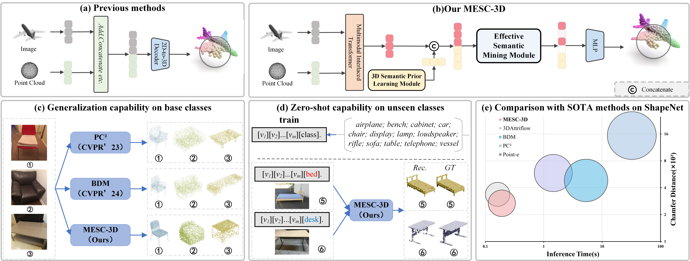
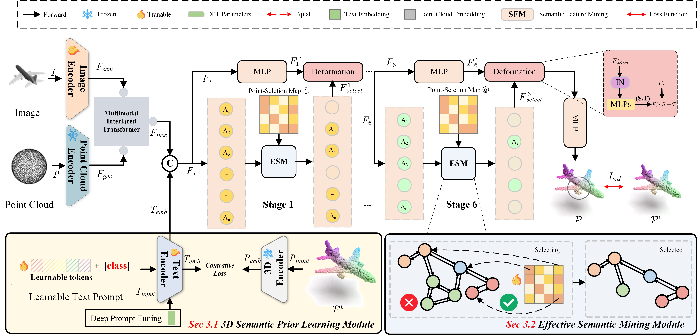

<p align="center">
<h1 align="center">MESC-3D:Mining Effective Semantic Cues for 3D Reconstruction from a Single Image(CVPR 2025)</h1>
<!-- <p align="center">
    <a href="https://junshengzhou.github.io/"><strong>Junsheng Zhou*</strong></a>
    ·
    <a href="https://weiqi-zhang.github.io/UDiFF/"><strong>Weiqi Zhang*</strong></a>
    ·
    <a href="https://mabaorui.github.io/"><strong>Baorui Ma</strong></a>
    ·
    <a href="https://dblp.org/pid/261/1098.html"><strong>Kanle Shi</strong></a>
    ·
    <a href="https://yushen-liu.github.io/"><strong>Yu-Shen Liu</strong></a>
    ·
    <a href="https://h312h.github.io/"><strong>Zhizhong Han</strong></a>
</p>
<p align="center"><strong>(* Equal Contribution)</strong></p> -->
<!-- <h3 align="center"><a href="https://arxiv.org/abs/2404.06851">Paper</a> | <a href="https://weiqi-zhang.github.io/UDiFF/">Project Page</a></h3> -->
<h3 align="center"><a href="https://arxiv.org/abs/2502.20861">Paper</a></h3>
<div align="center"></div>
</p>
<p align="center">
    
</p>

We release the code of the paper <a href="https://arxiv.org/abs/2502.20861">MESC-3D:Mining Effective Semantic Cues for 3D Reconstruction from a Single Image</a> in this repository.


## Abstract

<p>
            In this work, we propose a novel single-image 3D reconstruction method called Mining Effective Semantic Cues for 3D Reconstruction from a Single Image (MESC-3D), which can actively mine effective semantic cues from entangled features. Specifically, we design an Effective Semantic Mining Module to establish connections between point clouds and image semantic attributes, enabling the point clouds to autonomously select the necessary information. Furthermore, to address the potential insufficiencies in semantic information from a single image, such as occlusions, inspired by the human ability to represent 3D objects using prior knowledge drawn from daily experiences, we introduce a 3DSPL. This module incorporates semantic understanding of spatial structures, enabling the model to interpret and reconstruct 3D objects with greater accuracy and realism, closely mirroring human perception of complex 3D environments. Extensive evaluations show that our method achieves significant improvements in reconstruction quality and robustness compared to prior works. Additionally, further experiments validate the strong generalization capabilities and excels in zero-shot preformance on unseen classes.  
          </p>


## Method

<p align="center">
  
</p>

<p style="margin-top: 30px">
            <b>Overview of MESC-3D.</b> Our network is composed of two main components. <b>(a)</b> The 3DSPL align point cloud modality features with text features, aiming to capture the unique 3D geometric characteristics of each category. <b>(b)</b> The ESM establishes a connection between the semantic feature Fi and the 3D point cloud at ith stage, allowing each point to autonomously select the most valuable semantic information. 
          </p>

## Installation
Clone this repository and install the required packages:

- Install python Dependencies
```shell

git clone https://github.com/QINGQINGLE/MESC-3D.git
cd MESC-3D

conda create -n mesc3d python=3.9
conda activate mesc3d
conda install pytorch==2.0.1 torchvision==0.15.2 torchaudio==2.0.2 pytorch-cuda=11.7 -c pytorch -c nvidia

pip install -r requirements.txt

```

- Compile PyTorch 3rd-party modules.

```shell

cd package/Pointnet2_PyTorch-master/
pip install -e .
pip install pointnet2_ops_lib/.

cd -
cd package/KNN_CUDA-master/
make && make install

```

- CLIP Usage
The following step is the usage and modification of CLIP.
```shell

pip install git+https://github.com/openai/CLIP.git
Or
pip install clip

```
Inplace
```shell
def encode_text(self, text):
    x = self.token_embedding(text).type(self.dtype)  # [batch_size, n_ctx, d_model]
    x = x + self.positional_embedding.type(self.dtype)
    ...
```
with 
```shell
def encode_token(self, token):
    x = self.token_embedding(token)
    return x
def encode_text(self, text, token):
    #x = self.token_embedding(text).type(self.dtype)  # [batch_size, n_ctx, d_model]
    x = text.type(self.dtype) + self.positional_embedding.type(self.dtype)
    ...
```
## Dataset

## Pre-training
-ULIP
+3
-CLIP
Path/ViT-B-16.pt
-PointMAE
modelnet_1k.pth
## Training 

## Testing

The remaining code is on the way.
